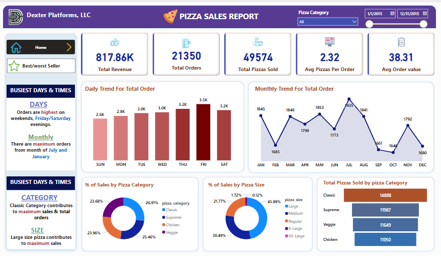
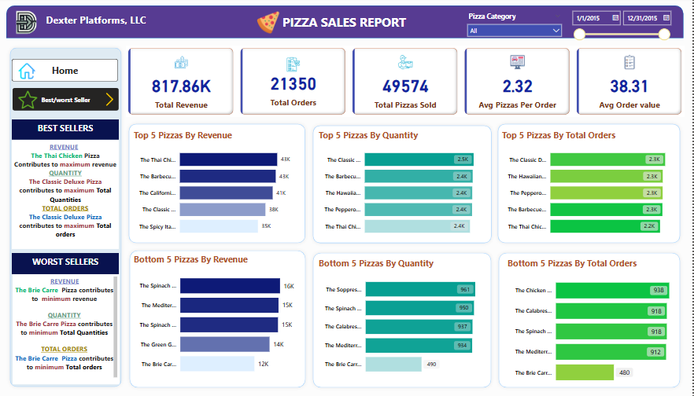

# Pizza Sales Analysis Project

Welcome to the **Pizza Sales Analysis** project! This project utilizes SQL for data extraction and manipulation, combined with Power BI for interactive data visualizations. The goal is to analyze pizza sales data and derive valuable insights for improving business strategies.

## Table of Contents

- [Project Overview](#project-overview)
- [Data Analysis with SQL](#data-analysis-with-sql)
- [Building Dashboards with Power BI](#building-dashboards-with-power-bi)
- [Key Insights](#key-insights)
- [Project Structure](#project-structure)
- [Tools & Technologies](#tools--technologies)

## Project Overview

The goal of this project is to gain insights into pizza sales using SQL for querying and Power BI for creating dynamic dashboards. We explore the following key metrics and dimensions:

- **Sales Trends**: Analyze sales data on daily, weekly, and monthly bases.
- **Pizza Category & Size**: Investigate sales performance by pizza category and size.
- **Best & Worst Selling Pizzas**: Identify the top-performing and least-selling pizzas.

## Data Analysis with SQL

SQL queries are used to analyze and summarize the sales data. Here are some examples of key SQL queries used:

### Pizza Sales Analysis

This project provides SQL queries used to analyze pizza sales data. The queries cover key performance indicators (KPIs), trends in pizza sales, and sales performance by pizza category, size, and more.

## KPI Analysis

These queries are used to calculate key performance metrics from the pizza sales data.

### 1. Total Revenue Order
```sql
SELECT sum(total_price) AS Total_revenue FROM pizza_sales;
```
### 2. Average Order Value
```sql
SELECT sum(total_price) / COUNT(DISTINCT order_id) AS Avg_Order_Value FROM pizza_sales;
```
### 3. Total Pizza Sold
```sql
SELECT sum(quantity) AS Total_Pizza_Sold FROM pizza_sales;
```
### 4. Total Orders
```sql
SELECT COUNT(DISTINCT order_id) AS Total_orders FROM pizza_sales;
```
### 5. Average Pizzas Per Order
```sql
SELECT CAST(CAST(SUM(quantity) AS DECIMAL(10,2)) / 
CAST(COUNT(DISTINCT order_id) AS DECIMAL(10,2)) AS DECIMAL(10,2)) AS Avg_Pizzas_per_order FROM pizza_sales;
```
## Sales Trends
These queries help visualize trends in the pizza sales data over various time periods.

### 1. Daily Trend for Total Orders
```sql
SELECT DATENAME(DW, order_date) AS order_day, 
       COUNT(DISTINCT order_id) AS Total_orders
FROM pizza_sales
GROUP BY DATENAME(DW, order_date);
```
### 2. Hourly Trend for Orders
```sql
SELECT DATEPART(HOUR, order_time) AS order_hours, 
       COUNT(DISTINCT order_id) AS total_orders
FROM pizza_sales
GROUP BY DATEPART(HOUR, order_time)
ORDER BY DATEPART(HOUR, order_time);
```
### 3. Monthly Trend for Total Orders
```sql
SELECT DATENAME(MONTH, order_date) AS Month_Name, 
       COUNT(DISTINCT order_id) AS Total_orders
FROM pizza_sales
GROUP BY DATENAME(MONTH, order_date)
ORDER BY Total_Orders DESC;
```
## Pizza Category & Size Analysis
These queries analyze sales by pizza category and size.

### 1. Percentage of Sales by Pizza Category
```sql
SELECT pizza_category,
    SUM(total_price) AS Total_Sales, 
    SUM(total_price) * 100 / (SELECT SUM(total_price) FROM pizza_sales) AS Percentage_Of_Sales
FROM pizza_sales
GROUP BY pizza_category;
```
### 2. Percentage of Sales by Pizza Category (Filtered by January)
```sql
SELECT pizza_category, 
    SUM(total_price) AS Total_Sales, 
    SUM(total_price) * 100 / (SELECT SUM(total_price) FROM pizza_sales WHERE MONTH(order_date) = 1) AS Percentage_Of_Sales
FROM pizza_sales
WHERE MONTH(order_date) = 1 
GROUP BY pizza_category;
```
### 3. Percentage of Sales by Pizza Size
```sql
SELECT pizza_size, 
    CAST(SUM(total_price) AS DECIMAL(10,2)) AS Total_Sales, 
    CAST(SUM(total_price) * 100 / (SELECT SUM(total_price) FROM pizza_sales) AS DECIMAL(10,2)) AS Percentage_Of_Sales
FROM pizza_sales
GROUP BY pizza_size
ORDER BY Percentage_Of_Sales DESC;
```
## Top & Bottom Performers
These queries help identify the best and worst-performing pizzas in terms of revenue and quantity sold.

### 1. Top 5 Pizzas by Revenue & Order
```sql
SELECT TOP 5 pizza_name, 
    COUNT(DISTINCT order_id) AS Total_Order,  
    SUM(total_price) AS Total_Revenue
FROM pizza_sales
GROUP BY pizza_name
ORDER BY Total_Revenue DESC;
```
### 2. Lowest 5 Pizzas by Revenue & Order
```sql
SELECT TOP 5 pizza_name, 
    COUNT(DISTINCT order_id) AS Total_Order, 
    SUM(total_price) AS Total_Revenue
FROM pizza_sales
GROUP BY pizza_name
ORDER BY Total_Revenue ASC;
```
### 3. Top 5 Pizzas Sold in August
```sql
SELECT TOP 5 pizza_name,  
    SUM(quantity) AS Total_Pizzas_Sold
FROM pizza_sales
WHERE MONTH(order_date) = 8
GROUP BY pizza_name
ORDER BY Total_Pizzas_Sold DESC;
```
## Filtering Examples
These examples show how to filter the data by specific time periods like months and quarters.

### 1. Filter by Month (January)
```sql
SELECT DATENAME(DW, order_date) AS order_day, 
    COUNT(DISTINCT order_id) AS total_orders
FROM pizza_sales
WHERE MONTH(order_date) = 1  -- Output for January
GROUP BY DATENAME(DW, order_date);
```
### 2. Filter by Quarter (Quarter 1)
```sql
SELECT DATENAME(DW, order_date) AS order_day, 
    COUNT(DISTINCT order_id) AS total_orders
FROM pizza_sales
WHERE DATEPART(QUARTER, order_date) = 1  -- Output for Quarter 1
GROUP BY DATENAME(DW, order_date);
```
### SQL Queries
The following SQL queries can be used to derive meaningful insights from pizza sales data, such as revenue, quantity sold, and trends over different periods (daily, weekly, monthly). These queries are essential for decision-making in pizza business operations.

# Building Dashboards with Power BI

Power BI is used to create interactive dashboards that help visualize pizza sales data. The following dashboards and insights are included:

- **Sales Trends Dashboard**: Visualize sales over daily, weekly, and monthly periods.
- **Pizza Category & Size Breakdown**: Analyze sales by pizza category and size.
- **Top & Bottom Selling Pizzas**: Identify best and worst-selling pizzas based on revenue and quantity sold.

## How to Open and Explore the Power BI Report

1. Open Power BI Desktop.
2. Open the Power BI report file `Pizzs Sales Report.pbix`.
3. Explore the various interactive dashboards:
   - Use the filters to drill down into specific time periods, pizza categories, or sizes.
   - Hover over visuals to view more detailed information.
     
### Home Page Report Dashboard


### Best/Worst Sellers Report Dashboard


## Key Insights

From the analysis, we gathered the following insights:

### Top Performers:
- **Revenue**: Thai Chicken Pizza had the highest revenue.
- **Quantity Sold**: Classic Deluxe Pizza was the most sold.
- **Orders**: Classic Deluxe Pizza also led in total orders.

### Underperformers:
- **Revenue**: Brie Carre Pizza had the lowest revenue.
- **Quantity Sold**: Brie Carre Pizza had the least number of pizzas sold.
- **Orders**: Brie Carre Pizza had the fewest orders placed.

### Sales Trends:
- Sales peak on **Fridays and Saturdays**.
- **12:00 PM - 1:00 PM** is the busiest hour of the day.
- The month of **July** generates the highest revenue, while **October** shows the lowest.

## Project Structure

Here’s the structure of the project directory:
```
├── LICENSE
├── README.md              <- README for using this project.
├── query                  <- SQL queries for data analysis.
│   ├── pizza_sales_db.sql <- Database creation script.
│   └── query.sql          <- Final SQL queries used for analysis.
├── reports                <- Final reports of this project.
│   ├── Pizza_Sales_Report.pdf <- Detailed report of the analysis.
│   └── query_report.pdf  <- Query results verification report.
├── src                    <- Source files for this project.
│   ├── data               <- Data used in the project.
│   └── pizza_sales_images <- Dashboard images.
├── data_dictionary.csv    <- Data dictionary for the dataset.
```

This structure provides a clear overview of the project and its contents, helping users understand how the project is organized.


## Tools & Technologies

- **SQL**: Used for data extraction and transformation.
- **Power BI**: Used to create interactive dashboards and data visualizations.


